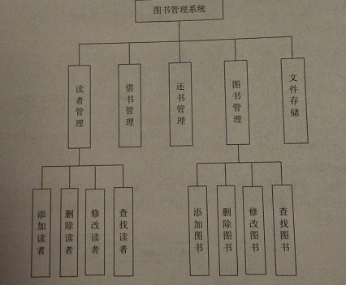

# 功能设计要求

##  借书功能

借书功能实现在借书时要求输入读者学号和书号，然后进行相关借阅信息的修改和存储。读者和书籍要有相应的状态标志来区分书籍的状态和读者的状态，也就是读者有无借书，和书籍是否已经被借阅等。

##  还书功能

该功能实现在还书时要求输入读者学号和书号，然后进行相应状态的修改和存储，读者换完书后也要修改相应的状态标志。

##  图书管理功能

能够实现图书维护的基本操作，包含图书的增加、更改、删除、查找和显示操作。

##  用户管理功能

能够实现读者维护的基本操作，包含读者的增加、更改、删除、查找和显示操作。

##  文件存储功能

可以按照默认名字或指定名字存储图书信息、读者信息以及管理员信息；更新维护信息的内容。

# 总体设计


## 功能结构

图书管理系统

1. 读者管理

    1. 添加读者

    2. 删除读者

    3. 修改读者

    4. 查找读者

2. 借书管理

3. 还书管理

4. 图书管理

    1. 添加图书

    2. 删除图书

    3. 修改图书

    4. 查找图书

4. 文件存储



##  类的设计

包含5个类，具体如下：

###  CUser类

数据成员：

``` c++
private:
    int code;           //表示用户编号；
    string name;        //表示用户姓名
public:
    CUser();                    // 默认构造函数
    CUser(int id, string na);   //构造函数，初始化用户信息
    void setcode(int n);        //用来设置用户编号
    int getcode();              //用来获取用户编号
    void setname(string na);    //用来设置用户姓名
    string  getname();          //用来获取用户姓名
    void show();                //用来显示用户的基本信息
```

### CReader 类

数据成员：

``` c++
private:
    bool Is_Existing;           //true存在，false删除
    bool Is_Borrowing;          //true借过书，false没有借书
    CBook brbook;               //表示读者所借的图书
public:
    CReader();                  //默认的构造函数
    CReader(int id, string na); //构造函数，初始化读者信息
    bool get_Existing();        //用来获取删除标志
    void set_Existing(bool);    //用来设置删除标志
    bool get_Borrowing();       //用来获取读者借阅情况
    void set_Borrowing(bool);   //用来设置读者借阅情况
    void setbrbook(CBook bt);   //用来记录读者结束信息
    CBook getbrbook();          //用来获取读者结束信息
    void show();                //重写基类成员，显示读者的基本信息情况和借书情况
```

### CBook类

``` c++
private:
    int code;               //图书编号
    string name;            //图书名称
    bool Is_Stock;          //true为在架，false为借出
    bool Is_Existing;       //true为存在, false为删除
public:
    CBook();                //默认构造函数
    CBook(int no,string na);//构造函数，初始化图书信息
    void setcode(int n);    //设置图书编号
    int getcode();          //获取图书编号
    void setname(string na);//设置图书名称
    string getname();       //获取图书名称
    bool  get_Stock();      //获取图书是否在库信息
    void set_Stock(bool);   // 设置图书是否在库信息
    bool  get_Existing();   //获取存在标志
    void set_Existing(bool);//设置存在标志
```

# DateBase类

``` c++
private:
    vector <CBook> bookarry;     //图书集合
    vector <CReader> rearderarray; // 存储读者信息的集合
public:
    void addreader();          //添加读者
    int findreader(int suffix);//查找读者，这个函数用于借书还书操作。
    int findreader();          //查找读者，这个函数用于读者维护操作
    void editreader();         //编辑读者信息
    void delreaders();          //删除读者，读者如果借书要还书后才能删除
    void listreaders();         //显示所有读者
    
    void addbook() ;           //添加图书
    int findbook(int suffix);  //查找图书，这个函数用于借书还书操作
    int findbook() ;           //查找图书，用于图书维护操作
    void editbook();           //编辑图书
    void delbook();            //删除图书
    void listbooks() ;          //显示全部图书
```

# UserInterface类
``` c++
private:
    DataBase database;
public:
    void landbook();            //借书
    void returnbook();          //还书
    void managereaders();       //读者管理
    void managebooks();         //图书管理
    void save(string filename); //保存到文件
    void load(string filename); //从文件加载
```    

## 功能结构

图书管理系统

1. 读者管理

    1. 添加读者

    2. 删除读者

    3. 修改读者

    4. 查找读者

2. 借书管理

3. 还书管理

4. 图书管理

    1. 添加图书

    2. 删除图书

    3. 修改图书

    4. 查找图书

4. 文件存储
